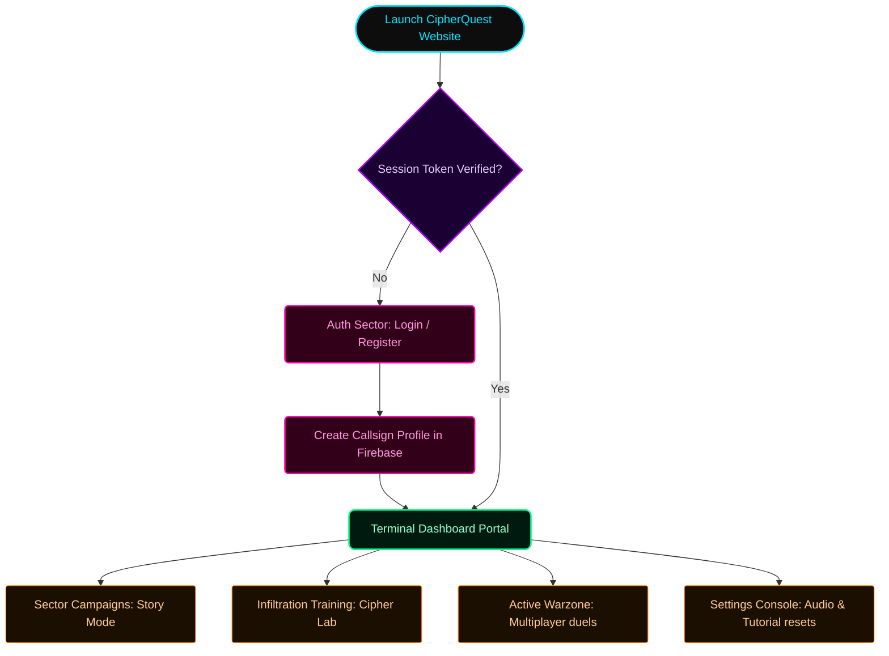
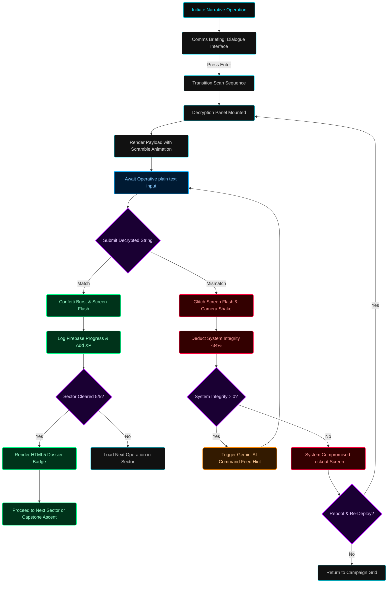
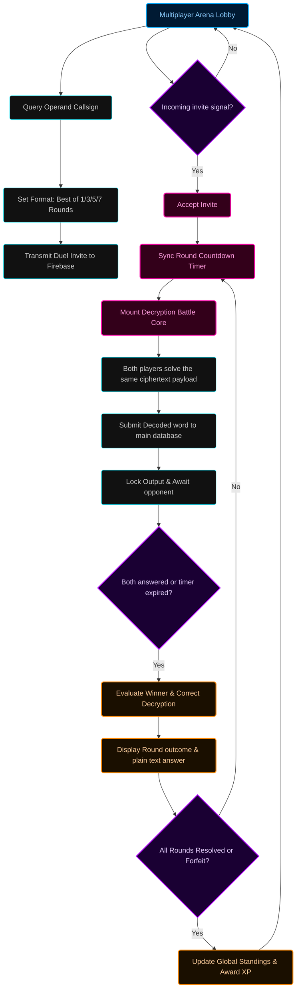
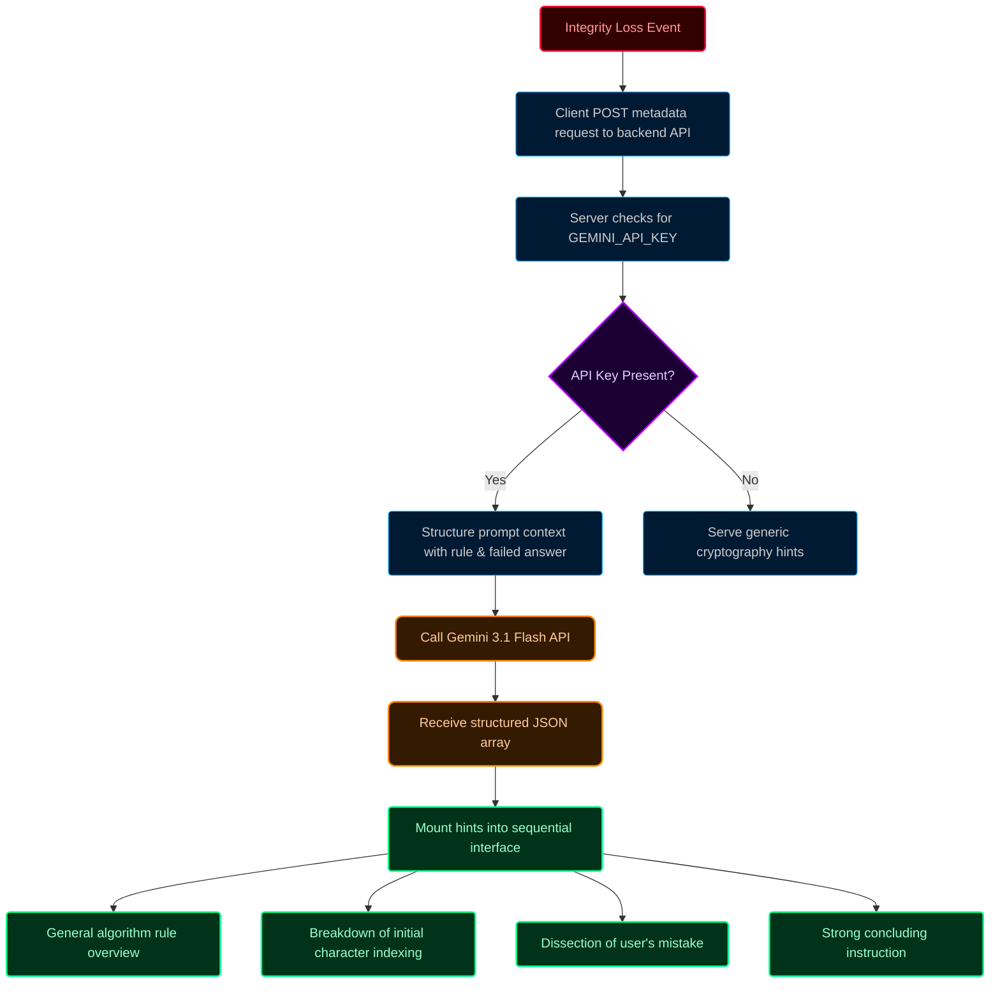

# 🌌 CipherQuest v3

<p align="center">
  
</p>

<p align="center">
  <strong>An Advanced Hacking & Cryptographic Warfare Terminal</strong>
</p>

<p align="center">
  
  
  
</p>

---

## 👁️ System Overview

**CipherQuest v3** is an immersive, gamified web application that puts you in the shoes of an elite resistance operative. In a dystopian world overrun by autonomous corporate mainframe systems, your primary weapon is cryptanalysis. Your mission: infiltrate hostile communication lines, dissect encrypted network packages, and dismantle high-grade mainframe security protocols.

The application weaves together a high-fidelity **Cyberpunk / Advanced Terminal aesthetic** with a comprehensive suite of **20 cryptography algorithms**, an intense real-time **PvP multiplayer battle arena**, and an unparalleled **AI-powered command feed hint agent** driven by the Gemini 3.1 Flash model. It is an educational tool forged into a digital battlefield.

---

## 🎮 How the Game Works

The core gameplay centers around **deciphering encrypted payloads**. The ecosystem is partitioned into three primary operational modules:

### 1. The Intercept-Decrypt Loop
- **Signal Interception:** You are presented with a technical payload containing raw ciphertext, the underlying cryptographic algorithm category (e.g., *Caesar Shift, Mini RSA, Merkle Tree*), and a structural rule parameter.
- **System Integrity:** Your terminal has a fragile security margin represented by **3 Shield Nodes** (100% Integrity). Every incorrect decryption attempt leaks network noise, drawing hostile mainframe security attention. Each failure deducts **34% Integrity**.
- **System Compromise:** If your integrity flatlines to 0%, the Syndicate firewall enacts a hard lockdown on your terminal. You must reboot the system and re-deploy.
- **Neural Breach:** Entering the correct plaintext triggers a power-surge screen flash, canvas-confetti bursts, and permanently logs XP to your remote operative profile.

### 2. Clearance Progression
- Operations are strictly grouped into **4 physical main sectors**. 
- Each sector remains sealed until you achieve a **100% clearance rate** in the preceding sector's nodes.
- Breaching a sector generates a highly-coveted, downloadable **Classified Neural Clearance Certificate**. These are procedurally drawn on an HTML5 canvas, etched with your unique Call Sign, clearance level, and a precise chronometer timestamp.

### 3. Combat Academy & Sandbox
- **Cipher Lab:** A sandbox neural gym containing procedural missions of dynamically scaling difficulty. Solve them under intense time constraints to farm XP and assert dominance on the global leaderboards.
- **Combat Academy:** A guided training module welcoming newly awakened recruits to the console, ensuring you know how to operate the terminal interface before live deployment.

---

## ⚡ Core Features

### 🌌 1. High-Fidelity Cyberpunk UI & UX
* **Dynamic Theme Engines:** Select from 5 operative avatars that instantly bind dynamic CSS variables (`--current-theme-color`) to control terminal colors, glowing neon borders, drop shadows, and canvas confetti parameters.
  * 🌐 **Cyber Cyan** (`#00e5ff`)
  * 🟢 **Matrix Green** (`#00ff88`)
  * 🟣 **Neon Purple** (`#b200ff`)
  * 🟠 **Plasma Orange** (`#ff8800`)
  * 🔴 **Laser Magenta** (`#ff00aa`)
* **Terminal Vignette & Grids:** A layered layout rendering scanlines, interactive SVG circuit nodes, desaturated cityscape background blends, and radial vignettes focusing focus to input cores.
* **Micro-interactions:** Character-scramble text animations, aggressive screen shake/glitch flashes on failure, sliding ambient lighting sweeps, and organic canvas particle algorithms.

### 🧠 2. Gemini 3.1 Flash AI Hint System
When system integrity takes a hit, the terminal initiates an emergency outbound link to the **AI Command Feed**.
* The Flask server formats the current plaintext, target ciphertext, exact rule, and your failed input payload.
* It interfaces with the **Google GenAI API** utilizing `gemini-3.1-flash-lite`.
* The AI dynamically evaluates your specific cognitive misstep and serves **4 structured intel packets**:
  1. **Intel Level 1:** High-level algorithm blueprint.
  2. **Intel Level 2:** Logic breakdown for the initial character index.
  3. **Intel Level 3:** Tailored feedback dissecting your incorrect attempt.
  4. **Intel Level 4:** Concluding tactical tip.

### ⚔️ 3. Tactical PvP Multiplayer Battles
Challenge other resistance operatives in brutal real-time decryption duels.
* **Matchmaking & Search:** Query global callsigns and dispatch invite vectors.
* **Custom Game Modes:** Select round systems (Best of 1, 3, 5, or 7).
* **Sync Countdowns:** Interactive pre-round loading sequence perfectly synchronized against network server clocks.
* **Dual Intercept Loop:** Both players decrypt the exact same payload simultaneously. The system violently awards the round to the quickest correct decoder.
* **Tactical Forfeits:** Includes active surrender triggers for operatives wishing to abort high-risk operations.

### 📇 4. Procedural Canvas Certificate Generator
Upon shattering main narrative sectors, you can export a classified clearance certificate:
* Rendered on a hidden dynamic HTML5 `<canvas>`.
* Outfitted with procedural technical grids, classified dossiers, corner accents, fingerprint wave arcs, and custom barcodes generated using mathematical randomizing arrays.

---

## 📊 Cipher Cryptography Specifications

CipherQuest v3 features **20 cryptographic schemes** heavily distributed across the 4 main mainframe sectors:

| Sector | Mission | Algorithm Code | Encryption & Mathematical Specification |
| :--- | :--- | :--- | :--- |
| **S1: The Outskirts** | `1-1` | **Reverse** | Reverses the string sequence. e.g., $S \to S_{reversed}$. |
| | `1-2` | **Caesar** | Linear index shift: $C_i = (P_i + K) \pmod{26}$. |
| | `1-3` | **Atbash** | Inverted alphabet lookup: $C_i = 25 - P_i$. |
| | `1-4` | **Monoalphabetic** | Shuffled mapping where $P \to C$ uses a randomized key substitution array. |
| | `1-5` | **Fixed Number** | Custom encoding. Letters mapped: $0-9 \to 0-9$, $a-z \to 10-35$, $A-Z \to 36-61$. |
| **S2: The Neon Slums** | `2-1` | **Reverse-Caesar** | Reverses input string, then applies a Caesar shift index $+K$. |
| | `2-2` | **Alternating Shift** | Even index shifts by $+X$, odd index shifts by $-Y$. |
| | `2-3` | **Positional Shift** | Index-progressive delta: Shifts character $P_i$ by offset $(i + 1)$. |
| | `2-4` | **Vowel Scrambler** | Vowels mapped to integers: $A \to 1, E \to 2, I \to 3, O \to 4, U \to 5$. |
| | `2-5` | **Keyed Substitution** | Alphabet index built using $Keyword + Remaining\ Letters$. |
| **S3: The Corporate Grid** | `3-1` | **Modular Shift** | Arithmetic wrapping shift: $C_i = (P_i + K) \pmod{26}$. |
| | `3-2` | **Vigenère** | Polyalphabetic shift: $C_i = (P_i + Key_{i \pmod{L}}) \pmod{26}$. |
| | `3-3` | **Affine** | Linear algebraic scale: $C_i = (a \cdot P_i + b) \pmod{26}$ with $\gcd(a, 26) = 1$. |
| | `3-4` | **Permutation** | Rail-fence transposition sorting even-index characters first, then odd-indexes. |
| | `3-5` | **Blocked Rotate** | Splits into blocks of 3, reverses the block, then shifts using Vigenère keyword key (CAT). |
| **S4: The Syndicate Core** | `4-1` | **Pairing** | Maps pairs $(a,b) \to (a+b \pmod{26}, a \cdot b \pmod{26})$. |
| | `4-2` | **Rotate Add** | Double-transform: shifts $P_i$ by the index value of its reversed counterpart. |
| | `4-3` | **Encrypt Additively** | Shifts $P_i$ by $(+1, +3, +5, +7)$ repeating, then reverses output. |
| | `4-4` | **Mini RSA** | Asymmetric exponentiation: $C_i = (P_i^e) \pmod n$. Values $\ge 26$ printed as raw numbers. |
| | `4-5` | **Mini Merkle Root** | Leaves mapped to $A=0$. Paired nodes hashed: $H(x, y) = (x \cdot 3 + y \cdot 7) \pmod{26}$ to root. |

---

## 📈 System Architecture Flowcharts

### 1. Main Navigation Protocol
This flowchart maps the primary application navigation paths and authentication gates.



### 2. Narrative Decryption Gameplay Loop
The logic system powering narrative missions and system integrity checking.



### 3. Multiplayer Battle Arena Loop
The brutal real-time multiplayer duel protocol.



### 4. AI-Powered Assistant Core
The algorithmic sequence pipeline for AI-assisted tactical command tips.



---

## 🛠️ Development & Deployment Setup

### 1. Environment Configurations (`.env`)
Create a `.env` file in the root directory:

```env
# Flask Server Configuration
PORT=5000
NODE_ENV=development

# Firebase Integration (Minified Service Account JSON)
FIREBASE_SERVICE_ACCOUNT_JSON={"type": "service_account", "project_id": "...", "private_key": "...", ...}

# Google Gemini AI Integration
GEMINI_API_KEY=AIzaSy...
```

### 2. Frontend Configuration & Running
Install dependencies and launch the Vite development server:

```bash
# Install packages
npm install

# Start local server
npm run dev
```

### 3. Backend Flask Configuration & Running
The Python backend acts as serverless functions (configured for Vercel integration in `vercel.json`):

```bash
# Create virtual environment
python -m venv venv
source venv/bin/activate  # Or Windows: venv\Scripts\activate

# Install requirements
pip install -r requirements.txt

# Start backend server
python api/index.py
```

### 4. Deploying to Vercel
The repository includes a custom `vercel.json` file directing `/api/*` requests to the Flask serverless functions and routing all other static resources to the index.html build file.

To publish:
```bash
# Deploy code
vercel --prod
```
The application triggers an internal keeps-alive heartbeat every 5 seconds, fetching `/api/ping` to prevent cold starts on Vercel's serverless function instances.

---

<p align="center">
  <strong>📡 SECURE TRANSMISSION ENDED. GOOD LUCK IN THE GRID.</strong>
</p>
